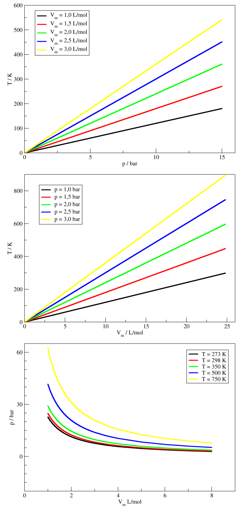

## Definições

Dentre os diferentes sistemas possíveis, os compostos por <b>gases</b> são os mais simples. Isso decorre do fato de as moléculas que compõem os gases estarem, geralmente, muito distantes umas das outras. Essa grande distância faz com que a energia de interação intermolecular seja relativamente pequena e torna desprezível o volume ocupado pelas moléculas em comparação ao volume total do sistema. Assim, tais sistemas são mais simples de estudar e descrever do que sistemas condensados – aqueles formados por líquidos e sólidos. Assim, gases são os primeiros sistemas que estudamos em Termodinâmica.

Contudo, mesmo gases reais ainda possuem propriedades que podem ser difíceis de serem descritas ou utilizadas em modelos teóricos. Quando a densidade de partículas é grande, não podemos desprezar nem as interações intermoleculares nem o volume ocupado pelas moléculas. Então, antes de estudarmos sistemas mais complexos, iniciaremos pelo modelo mais simples e famoso para gases: os <b>gases ideais</b> (GIs). GIs são gases formados por moléculas puntiformes (i.e., que não ocupam volume no espaço) e não interagentes (i.e., que não possuem energia de interação intermolecular).

Tais gases, quando confinados, podem apenas colidir elasticamente com as paredes dos recipientes que os contêm. E apesar de nenhum gás ser realmente ideal, gases reais podem se <b>comportar idealmente</b>, dependendo das condições. Para podermos discutir adequadamente quais condições são essas, precisamos definir quais variáveis macroscópicas podem ser utilizadas para descrever o estado de um gás, e precisamos definir, também, qual a relação matemática entre tais variáveis.

Gases podem ter o seu estado caracterizado por propriedades macroscópicas como pressão (<i>p</i>), volume (<i>V</i>), temperatura (<i>T</i>) e número de mols (<i>n</i>). Assim, se mesmas quantidades de um gás, à mesma pressão e à mesma temperatura, se encontrarem em dois lugares distintos do mundo, então podemos dizer que ambas se encontram no mesmo estado. Isso significa que toda e qualquer propriedade que seja medida em ambas terá o mesmo valor médio. Também significa que, caso um terceiro sistema seja preparado com os mesmos valores de número de mols, pressão e temperatura, então ele também estará no mesmo estado que os outros. Para além disso, todos os três sistemas possuirão o mesmo volume. Assim, podemos concluir que o volume depende exclusivamente da pressão, número de mols e temperatura.

## Equação de estado

Na verdade, essas quatro grandezas estão relacionadas entre si através de uma equação. Equações que relacionam variáveis que definem o estado de um sistema são conhecidas como <b>equações de estado</b> (e.d.e.).

### Teorema do virial

A equação de estado de um gás ideal, uma das equações mais conhecidas na físico-química, foi obtida a partir da combinação de observações experimentais de Boyle (relação p e V), Charles (relação V e T), Gay-Lussac (relação p e T) e de Avogadro (relação n e V). É possível obter essa equação a partir do <b>teorema do virial</b>. Para isso, tratamos as moléculas do gás como moléculas sem estrutura interna e, se assumirmos que todas as forças de interação entre as partículas são dadas por interações por pares, podemos escrever, para um sistema formado por <i>N</i> partículas, a equação:

  

    $${\vec F}_i = {\vec F}_i^p + {\vec F}_i^{pot} \\
    \color{blue}{\boldsymbol{\overline{\sum_i^N {\vec F}_i \cdot {\vec r}_i} = \overline{\sum_i^N {\vec F}_i^p \cdot {\vec r}_i} + \overline{\sum_i^N {\vec F}_i^{pot} \cdot {\vec r}_i}}}$$
  

  

    TC2.1
  

sendo ${\vec F}_i$ o vetor resultante da força exercida na <i>i</i>-ésima partícula, ${\vec r}_i$ é o vetor posição da partícula <i>i</i>, ${\vec F}_i^p$ é o vetor força que a parede exerce na partícula <i>i</i> durante uma colisão com a parede, e ${\vec F}_i^{pot}$ é o vetor força exercida na partícula <i>i</i> pela interação com as outras partículas do sistema. Para um gás ideal, o termo ${\vec F}_i^{pot}$ é zero para todas as <i>N</i> partículas.

É possível demonstrar que o termo da esquerda é igual a menos duas vezes a energia cinética média total do sistema (${\langle K \rangle}$), enquanto que o termo de colisão com as paredes do recipiente é igual a menos três vezes o produto da pressão pelo volume do sistema. Como todos os termos são iguais a zero em <a href="#TC2.1" style="color: blue; font-style: italic;">TC2.1</a>, então o segundo termo do lado direito também é. Então:

  

    $${-2}{\langle K \rangle} = - {3 pV} \\
    \color{blue}{\boldsymbol{\langle K \rangle = \frac{3}{2} pV}}$$
  

  

    TC2.2
  

### Interpretação microscópica da temperatura

Mas a média da energia cinética total do sistema pode ser calculada a partir da definição de média de uma propriedade para uma distribuição contínua, considerando que os três eixos de translação são equivalentes:

  

    $$\color{blue}{\boldsymbol{\langle K \rangle = 3N \int_{-\infty}^{+\infty} \frac{mv^2_x}{2} P_x dv_x = \frac {3}{2}Nk_B T}}$$
  

  

    TC2.3
  

sendo, aqui, $v_x$ a velocidade da partícula no eixo $x$, $P_x$ é a probabilidade de encontrarmos a partícula com velocidade $v_x$ dentro dos limites de integração e $k_B$ é a constante de Boltzmann. A forma da função $P_x$, que é a distribuição de Boltzmann, será discutida mais para frente. Esta equação, inclusive, permite estabelecermos uma interpretação microscópica da temperatura – tão facilmente compreendida por todos, mas de difícil definição. É possível escrever:

  

    $${\langle K \rangle = \frac {3}{2}Nk_B T} \\
    T =  \frac{2}{3Nk_B}\langle K \rangle \\
    \color{blue}{\boldsymbol {T = \frac{2}{3 k_B} \langle k \rangle}} $$
  

  

    TC2.4
  

e $\langle k \rangle$ é a energia cinética média de uma única partícula. Assumimos, aqui, que a energia cinética total será igual a $N \langle k \rangle$, pois as partículas que compõe o gás são idênticas. Podemos imaginar que $\langle k \rangle$ será tão maior quanto maior for a velocidade media da partícula. Assim, podemos ver que a idéia de que a temperatura está atrelada à velocidade das partículas possui raiz na <b>termodinâmica estatística</b> – ramo da termodinâmica que relaciona propriedades macroscópicas de sistemas com médias de propriedades de sistemas compostos por átomos e moléculas.

### Equação de estado de um GI

Voltando ao problema original, podemos finalmente combinar o resultado da energia cinética média total (<a href="#TC2.3" style="color: blue; font-style: italic;">TC2.3</a>) com a equação obtida pelo teorema do virial (<a href="#TC2.2" style="color: blue; font-style: italic;">TC2.2</a>):

  

    $${-2}{\langle K \rangle} = - {3 pV} \\
    -2 \frac{3}{2} Nk_B T = -3 pV \\
    Nk_B T = pV \\
    pV = n N_A k_B T \\
    \color{blue}{\boldsymbol{pV = nRT}}$$
  

  

    TC2.5
  

pois o produto do número de Avogadro ($N_A$) pela constante de Boltzmann ($k_B$) é igual à constante dos gases ideais ($R$).

Essa última equação (<a href="#TC2.5" style="color: blue; font-style: italic;">TC2.5</a>) é conhecida como <b>equação de estado de um gás ideal</b>. Ela recebe esse nome por fornecer uma relação matemática entre as variáveis de estado do sistema ($p$, $V$, $T$, $n$) e por assumirmos que as forças de interação intermoleculares são nulas e as moléculas puntiformes. Essa descrição mostra que a e.d.e. de um gás ideal surge das colisões das moléculas com as paredes do recipiente, oferecendo uma descrição teórica para a origem da relação entre pressão, volume, temperatura e número de mols de um gás ideal.

Além disso, vemos que a pressão de um gás está relacionada à frequência de colisão das moléculas com a parede do recipiente: cada colisão está associada a uma força exercida pela parede sobre a molécula; como a pressão é definida como força por unidade de área, as colisões estão diretamente relacionadas à sua magnitude. Quanto maior a frequência de colisão, maior a pressão exercida pelo gás. Por fim, essa interpretação também se aplica a gases reais, pois, embora surja um termo adicional na equação de estado devido às interações intermoleculares, os termos associados ao gás ideal permanecem inalterados.

 

 

    <h2 class="toolbox-title">Laboratório Virtual: Gás Ideal Bidimensional</h2>
    
Ajuste os parâmetros do sistema e avalie efeitos da frequência de colisão!

  

  

  

    
    

      

        
        

          
Parâmetros

          

            <label>N:</label>
            <input type="number" id="inp-n1" class="jsbox-input" value="150">
          

          

            <label>T:</label>
            <input type="number" id="inp-T" class="jsbox-input" value="300">
          

          

            <label>m:</label>
            <input type="number" id="inp-m1" class="jsbox-input" value="50">
          

        

        

          

            Últimos Resultados
            <button id="btn-clear-history" style="font-size: 0.8em; padding: 2px 6px; cursor: pointer; border: 1px solid #ccc; border-radius: 4px; background: #fff; color: #555;">Limpar</button>
          

          

            
Nenhuma simulação realizada.

          

        

        

          <button id="btn-run" class="jsbox-btn jsbox-btn-primary">Calcular</button>
        

        

          <input type="number" id="inp-steps" value="20000">
          <input type="number" id="inp-edge" value="70">
          <input type="number" id="inp-dt" value="0.005">
          <input type="number" id="inp-freqInterval" value="200">
          <input type="number" id="inp-r1" value="0">
          <input type="number" id="inp-n2" value="0">
          <input type="number" id="inp-r2" value="0.5">
          <input type="number" id="inp-m2" value="10">
          <input type="checkbox" id="inp-scaleV" checked>
        

      

    

      

        Progresso: 0%
      

      

        
        

          

            
Câmera da Simulação

            

              

                <button id="btn-play" class="jsbox-btn jsbox-btn-success">Reproduzir</button>
                <input type="range" id="inp-scrubber" class="jsbox-scrubber" min="0" max="0" value="0">
              

              <canvas id="sim-canvas" width="900" height="900" class="jsbox-canvas-container"></canvas>
            

          

        

        
        

          

            

              
              
Frequência de Colisões na Parede
             
              <svg viewBox="0 0 600 300" id="svg-freq" class="jsbox-chart" style="max-height: 350px;"></svg>
            
            

          

        

        
        

           <svg id="svg-hist"></svg>
           <svg id="svg-vel"></svg>
        

      

    

  

           
  

## Propriedades da e.d.e. de um GI

Vamos discutir algumas propriedades da equação de estado de um gás ideal. Experimentalmente, podemos controlar 4 variáveis de estado distintas desta equação: pressão, volume, número de mols e temperatura. No entanto, é difícil discutir a variação simultânea de mais de duas variáveis: para duas variáveis, precisamos de um gráfico 2D para representar a dependência de uma com a outra, para três variáveis, precisamos de um gráfico 3D, e assim por diante. Desta forma, para facilitar a compreensão da dependência entre as variáveis, fixamos algumas delas, usualmente. Normalmente, o número de mols da substância será uma constante (exceto no caso de transições de fase ou em reações químicas), restando apenas a pressão, o volume e a temperatura. Definindo o volume molar ($V_m = \overline V = V/n$), podemos reescrever a <a href="#TC2.5" style="color: blue; font-style: italic;">TC2.5</a> na forma:

  

    $$\color{blue}{\boldsymbol{pV_m = RT}}$$
  

  

    TC2.6
  

Em seguida, podemos fixar o valor de alguma outra variável e ver a dependência das outras duas variáveis que restaram. Então, podemos construir os gráficos da relação entre $p$ e $T$ a $V_m$ constante, ou entre $V_m$ e $T$ a $p$ constante, ou, ainda, entre $p$ e $V_m$ a $T$ constante, apresentados na Figura 1:

<b>Figura 1.</b> Gráficos da dependência entre duas das três variáveis $p$, $V_m$ e $T$ para um gás ideal, construídos utilizando a equação <a href="#TC2.6" style="color: blue; font-style: italic;">TC2.6</a>.

O gráfico de cima representa a relação da temperatura com a variação da pressão, a $V_m$ constante, para 5 valores diferentes de $V_m$. Vemos que, para um gás ideal, a temperatura aumenta linearmente com a pressão, se $V_m$ for fixo. Para valores maiores de $V_m$, a inclinação da reta será maior – como esperado pela <a href="#TC2.6" style="color: blue; font-style: italic;">TC2.6</a> – pois se $V_m$ é maior, para um gás chegar na mesma pressão, a temperatura deverá ser maior, também. A figura do meio mostra a dependência da temperatura pelo Vm a pressões fixas, para 5 valores distintos de pressão. Notamos que a relação aqui é a mesma (matematicamente) da anterior: um perfil linear e quanto maior a pressão, maior a inclinação da reta. A figura de baixo é a relação da pressão com o volume molar, a temperatura constante. Gráficos desse tipo são chamados de isotermas de $pV$.

Isotermas são curvas que representam a relação matemática entre duas ou mais variáveis quando o processo ocorre a temperatura constante, e são muito utilizadas na termodinâmica. Este último gráfico também mostra que a dependência entre pressão e volume molar é monotônica, ou seja, que ou a função sempre aumenta ou sempre diminui com o aumento da variável. No entanto, a relação aqui não é linear, mas sim inversa. O resultado aqui é o esperado para todos os casos: se a temperatura aumenta, a pressão aumenta (aumento da velocidade média das partículas leva ao aumento da frequência de colisão das partículas com a parede do recipiente, bem como ao aumento do momento de colisão com a mesma, o que aumenta a pressão exercida pelo gás); se o volume molar aumenta, a temperatura deve aumentar para manter a pressão constante; o aumento do volume molar leva à diminuição da pressão para uma temperatura constante.

 

Para visualizar o comportamento dos gráficos mostrados na Figura 1 de forma mais interativa, utilize o simulador abaixo para gerar as isotermas em tempo real e comparar diferentes estados termodinâmicos.

    

        
Laboratório Virtual

        
Equação de estado para Gases Ideais.

    

    

        

            
            

                

                    <label>Eixo X (Independente):</label>
                    <select class="axis-x">
                        <option value="V">Volume (V)</option>
                        <option value="T">Temperatura (T)</option>
                        <option value="p">Pressão (p)</option>
                        <option value="n">n (mol)</option>
                    </select>
                

                

                    <label>Eixo Y (Dependente):</label>
                    <select class="axis-y">
                        <option value="p" selected>Pressão (p)</option>
                        <option value="V">Volume (V)</option>
                        <option value="T">Temperatura (T)</option>
                        <option value="n">n (mol)</option>
                    </select>
                

                

                    <label>Curvas:</label>
                    <select class="num-curves">
                        <option value="1">1</option>
                        <option value="2">2</option>
                        <option value="3">3</option>
                    </select>
                

            

            

                
Parâmetros Fixos:

                

                    

            

            

                

                    <label>X (min - max):</label> 
                    <input type="number" class="xmin" value="1" style="width:45%"> - <input type="number" class="xmax" value="50" style="width:45%">
                

                

                    <label>Y (min - max):</label> 
                    <input type="number" class="ymin" value="0" style="width:45%"> - <input type="number" class="ymax" value="25" style="width:45%">
                

                

                    <button class="generate-btn" style="width: 100%; padding: 10px; background: #003366; color: white; border: none; border-radius: 5px; cursor: pointer; font-weight: bold; text-transform: uppercase;">
                        Atualizar Gráfico
                    </button>
                

            

        

        

            <canvas id="gasChart"></canvas>
        

    

 

Vimos qual é a equação de estado de um gás ideal. Contudo, o que devemos esperar para gases reais, i.e., quando as moléculas possuem tamanho finito e as interações intermoleculares não podem ser desprezadas?

