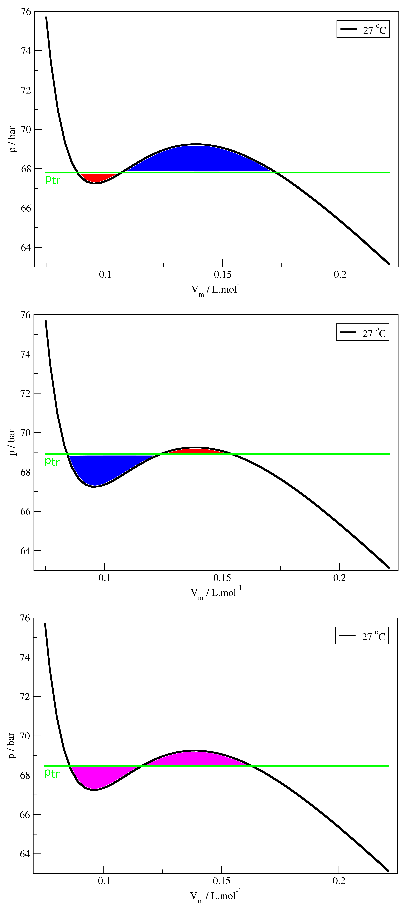

## O ponto crítico

Vimos que a relação matemática entre as variáveis de estado de gases ideais pode ser descrita através de equações de estado, como as equações de vdW (<a href="../A3/#TC3.4" style="color: blue; font-style: italic;">TC3.4</a>), de RK (<a href="../A3/#TC3.5" style="color: blue; font-style: italic;">TC3.5</a>) ou de PR (<a href="../A3/#TC3.6" style="color: blue; font-style: italic;">TC3.6</a>). Essas equações, contudo, são equações cúbicas no volume. Isso significa que podemos reescrever, por exemplo, a equação de Redlich-Kwong na forma:

  

    $$\color{blue}{\boldsymbol{\bar V^3 - \frac{RT}{p} \bar V^2 - \left( B^2 + \frac{BRT}{p} - \frac{A}{p T^{1/2}} \right) \bar V - \frac{AB}{p T^{1/2}}= 0}}$$
  

  

    TC4.1
  

A equação acima sugere que há uma dependência cúbica entre volume molar e pressão em uma isoterma. Então, quando construímos as isotermas de pressão em função do volume, utilizando a equação de RK, por exemplo, obteremos o seguinte gráfico na região de temperatura entre 27 &deg;C e 36 &deg;C (Figura 1).

<b>Figura 1.</b> Isotermas de pressão vs volume molar para CO2 na faixa de temperatura entre 27 a 36 &deg;C.

A Figura 1 mostra diferentes isotermas esperadas para CO2 pela e.d.e. de RK. Conforme a temperatura diminui, a curva é deslocada para menores valores de pressão para um mesmo valor de volume molar. A curva de maior temperatura possui um comportamento monotônico: conforme o volume molar aumenta, a pressão diminui para aquela dada temperatura. O mesmo ocorre para $T = 32$ &deg;C, mas observamos um plateau para $T = 30,99$ &deg;C em, aproximadamente, $\bar V$ = 0,12 L.mol-1. Isso significa que, nessa região, o aumento do volume molar não é acompanhado por uma diminuição da pressão do gás. Para temperaturas menores do que 30,99 &deg;C, algo estranho é observado no perfil da pressão por volume molar para o CO2: para $T = 27$ &deg;C, por exemplo, há uma região do gráfico  (entre 0,09 e 0,14 L.mol-1) em que o aumento do volume molar, a temperatura constante, leva a um aumento na pressão! Certamente, esse não é o comportamento esperado (e observado) para um gás – ideal ou não.

### Propriedades críticas

Experimentalmente, é sabido que, para o CO2, é impossível liquefazer o gás a temperaturas acima de 30,99 &deg;C, não importa qual pressão seja exercida sobre o sistema. Contudo, para temperaturas menores que essa, é possível promover a transição de gás para líquido, caso o sistema seja comprimido o suficiente. Isso é válido para CO2 e para todos os outros gases: há uma temperatura acima da qual é impossível liquefazer o gás. Essa temperatura é chamada de <b>temperatura crítica</b>, $T_C$. No caso do CO2, $T_C$ = 30,99 &deg;C e outros valores são encontrados para diferentes gases, a depender das interações intermoleculares.

Para He, $T_C$ é de aproximadamente -267,95 &deg;C (5,2 K), pois as interações intermoleculares são fracas. Já para H2O, $T_C$ = 374 &deg;C (647,15 K), pois as interações são muito fortes. Voltando ao gráfico do N2O a 30,99 &deg;C, há um ponto na isoterma em $T_C$ na qual a derivada da curva é igual a zero – um ponto de inflexão. Esse ponto é conhecido como <b>ponto crítico</b> e o volume molar nesse ponto é chamado de <b>volume molar crítico</b>, $\bar V_C$, e a pressão de <b>pressão crítica</b>, $p_C$. Notemos que cada gás possuirá apenas um conjunto de valores críticos – o ponto depende, exclusivamente, da natureza do gás em questão.

Para temperaturas acima da $T_C$, o sistema se comporta sempre como um gás. Mas e abaixo da $T_C$? Abaixo dela, o sistema poderá estar na fase gasosa ou líquida! Experimentalmente, vemos que, abaixo da $T_C$, a compressão de um gás leva à transição gás-líquido. Vamos imaginar que iniciamos com um sistema, com temperatura $T$ constante e $T \lt T_C$, em uma pressão baixa e volume molar alto – o suficiente para que o sistema se encontre na fase gasosa. Caso a pressão seja aumentada em passos graduais, eventualmente chegaremos a uma pressão alta o suficiente (e volume molar baixo o suficiente) para que a transição gás-líquido seja observada. Durante o processo de transição de fase, observamos que a pressão se mantém constante enquanto o volume molar diminui consideravelmente (Figura 2). Enquanto isso acontece, o gás vai sendo convertido em líquido – gás e líquido coexistem durante a transição. Quando todo o gás tiver sido convertido em líquido, veremos que a pressão precisará subir muito para que pequenas variações de volume molar sejam observadas – líquidos são, no geral, pouco compressíveis ou mesmo incompressíveis. Assim, as curvas $pV$ abaixo da $T_C$, para um gás real, representam tanto a fase gasosa quanto a fase líquida.

<b>Figura 2.</b> Curva pV para CO2 a 27 &deg;C. As setas verticais indicam o início da transição gás-líquido, enquanto as setas curvas indicam as regiões das curvas em que temos ou apenas o gás, ou apenas o líquido. A região horizontal da curva indica a coexistência de líquido e gás. A linha pontilhada verde indica a pressão de transição de fase, ptr.

## A construção de Maxwell

Do ponto de vista experimental, a região plana da curva pode ser facilmente determinada. Entretanto, devemos nos perguntar: por que a pressão é constante e possui aquele valor definido durante a transição? A resposta para tal pergunta tem origem na termodinâmica – que discutiremos mais tarde – e podemos definí-la, do ponto de vista teórico, utilizando o método conhecido como construção de Maxwell. Este método, que só pode ser utilizado caso a curva $pV$ teórica consiga reproduzir adequadamente as regiões apenas com líquido ou gás, consiste em: <b>1)</b> traçar uma curva isobárica (mesma pressão) no gráfico, na região entre o mínimo e o máximo locais da curva $pV$ e; <b>2)</b> ajustar o valor da curva isobárica de tal forma que a integral entre a curva isobárica e a curva $pV$, na região do mínimo, seja igual à integral entre a curva $pV$ e a isobárica, na região do máximo.

A figura abaixo (Figura 3) mostra três ajustes distintos para o valor da curva isobárica e como as integrais variam conforme o seu valor. A figura da esquerda mostra as duas integrais (áreas vermelha e azul) quando o valor de ptr é muito baixo: a área na região do mínimo é menor do que a área na região do máximo. A figura do centro mostra o caso em que o valor de ptr é muito alto, e o oposto é observado: a área na região do mínimo é maior que a área na região do máximo (áreas azul e vermelha). A figura da direita mostra o caso em que o valor de ptr é o ideal e as duas áreas (em rosa) são iguais. Devemos lembrar que, entretanto, a curva teórica deve ser sempre comparada à curva experimental – a curva teórica deve reproduzir não apenas os pontos para gás ou líquido puros, mas também o valor de ptr obtido deve ser o mesmo (ou muito próximo) do observado experimentalmente. Ainda, notamos que as equações cúbicas de estado de gases reais também podem representar tanto líquidos quanto gases – são equações de fluidos - mas devemos lembrar que a região de transição deve ser ajustada através da construção de Maxwell.

<b>Figura 3.</b> A construção de Maxwell para CO2 a 27 &deg;C a partir da equação de vdW. A figura de cima mostra o caso em que ptr é muito baixo; a central mostra o caso em que ptr é muito alto; a de baixo o caso em que ptr é o ideal e as áreas são iguais.

Podemos plotar as curvas para diferentes temperaturas e veremos que os valores de ptr dependem da temperatura, bem como os valores de volume molar de início e fim de transição de fase. É possível traçar uma curva conectando esses pontos de $\bar V$ para as diferentes temperaturas e obter o que chamamos de <b>curva de coexistência</b>: todos os pontos dentro dessa curva possuem tanto a fase gasosa quanto a fase líquida coexistindo (Figura 4).

<b>Figura 4.</b> As diferentes isotermas para CO2. A curva tracejada vermelha é a curva de coexistência e o ponto preto é o ponto crítico – máximo na curva de coexistência.

## O ponto crítico e equações de estado

A determinação do valor do ponto crítico é de grande utilidade para a termodinâmica. A partir dele, podemos atribuir valores para os parâmetros das equações de estado – vdW, RK ou PR, por exemplo. Temos duas informações sobre a curva $pV$ no ponto crítico: a derivada de $p$ com relação a $\bar V$ é zero, e a derivada segunda também será zero, por ser um ponto de inflexão (assíntota horizontal). Ou seja:

  

    $$\color{blue}{\boldsymbol{\left( \frac{\partial p}{\partial \bar V} \right)_{T_C} = 0 \quad ; \quad \left( \frac{\partial^2 p}{\partial \bar V^2} \right)_{T_C} = 0}}$$
  

  

    TC4.2
  

e a resolução das equações <a href="#TC4.2" style="color: blue; font-style: italic;">TC4.2</a> fornecem os valores de $p_C$ e de $\bar V_C$, pois apenas nesse ponto as equações são verdadeiras.

Para a e.d.e. de vdW, a combinação das duas equações acima fornecem as relações:

  

    $$\color{blue}{\boldsymbol{\bar V_C = 3b \quad ; \quad T_C = \frac{8a}{27bR} \quad ; \quad p_C = \frac{a}{27b^2}}}$$
  

  

    TC4.3
  

### Constantes de e.d.e. e propriedades críticas

Notamos aqui que são apenas duas variáveis e três equações. Assim, a partir dos valores críticos seria possível obter diferentes valores para os parâmetros $a$ e $b$ de vdW. Contudo, como a determinação dos valores de $p_C$ e de $T_C$ são mais precisos do que de $\bar V_C$, utilizamos as duas últimas relações de <a href="#TC4.3" style="color: blue; font-style: italic;">TC4.3</a> para definir os valores de $a$ e de $b$. Se combinarmos essas duas relações e resolvermos para o valor de $b$, e depois utilizarmos essa expressão de $ b$ para definir $a$, obteremos as seguintes relações:

  

    $$\color{blue}{\boldsymbol{b = \frac{RT_C}{8p_C} \quad ; \quad a = \frac{27(RT_C)^2}{64p_C}}}$$
  

  

    TC4.4
  

e um procedimento similar pode ser feito para a equação de RK ou de PR, gerando parâmetros para essas e.d.e.'s em função do ponto crítico.

Independente da equação utilizada, um fato curioso é observado para todas elas. Caso utilizemos as equações em <a href="#TC4.3" style="color: blue; font-style: italic;">TC4.3</a>, obteremos a seguinte relação:

  

    $$\color{blue}{\boldsymbol{\frac{p_C \bar V_C}{RT_C} = \frac{3}{8} = 0,375}}$$
  

  

    TC4.5
  

e a e.d.e. de RK fornece outra constante, 0,333, e a de PR outra, 0,3074. Contudo, todas elas fornecem uma constante. Qual é o significado disso?

## O princípio dos estados correspondentes

Uma forma de compreender esse resultado pode ser obtida através da manipulação da equação de vdW, por exemplo. Combinando as equações <a href="#TC4.4" style="color: blue; font-style: italic;">TC4.4</a> e <a href="#TC4.5" style="color: blue; font-style: italic;">TC4.5</a>, podemos escrever $a$ e $b$ em função das constantes críticas. Se, em seguida, substituirmos $a$ e $b$ na equação de estado de vdW (<a href="../A3/#TC3.4" style="color: blue; font-style: italic;">TC3.4</a>), podemos manipulá-la e obter:

  

    $$a = 3p_C \bar V_C^2 \quad ; \quad b = \frac{\bar V_C}{3}\\
    \left(p + \frac{3p_C \bar V_C^2}{\bar V^2} \right) \left(\bar V - \frac{\bar V_C}{3} \right) = RT\\
    \color{red}{\boldsymbol{\left[ \frac{p}{p_C} +3 \left( \frac{\bar V_C}{\bar V} \right)^2 \right] \left[ \frac{\bar V}{\bar V_C} - \frac{1}{3} \right] = \frac{RT}{p_C \bar V_C} = \frac{8}{3} \frac{T}{T_C}}} \\
    \color{blue}{\boldsymbol{\left( p_R + \frac{3}{\bar V_R^2} \right) \left( \bar V_R - \frac{1}{3} \right) = \frac{8}{3} T_R}}$$
  

  

    TC4.6a
    TC4.6b
  

e a equação <a href="#TC4." style="color: blue; font-style: italic;">TC4.6b</a> foi obtida a partir da equação <a href="#TC4.6" style="color: red; font-style: italic;">TC4.6a</a> definindo novas quantidades chamadas de <b>propriedades reduzidas</b>, na forma:

  

    $$\color{blue}{\boldsymbol{p_R = \frac{p}{p_C} \quad ; \quad \bar V_R = \frac{\bar V}{\bar V_C}} \quad ; \quad T_C = \frac{T}{T_C}}$$
  

  

    TC4.7
  

e ressaltamos que procedimento feito para obter as equações <a href="#TC4.6" style="color: blue; font-style: italic;">TC4.6b</a> poderia ter sido feito para as equações de RK ou de PR, fornecendo equações similares e de mesmas características que a aqui obtida.

A equação <a href="#TC4.6" style="color: blue; font-style: italic;">TC4.6b</a> possui uma característica peculiar: ela não se refere a um gás específico, mas sim a todos os gases que obedecem à equação de vdW! Isso significa que dois gases de vdW distintos que se encontrem no mesmo volume molar reduzido e na mesma temperatura reduzida também possuirão a mesma pressão reduzida. Por isso, dizemos que ambos estão em <b>estados correspondentes</b>, isto é, possuem os mesmos valores de $p_R$, $\bar V_R$ e $T_R$. Isso significa, também, que uma isoterma de temperatura reduzida deve conter todos os gases de vdW.

De fato, quando construímos o gráfico de fator de compressibilidade em função de pressão reduzida, para a mesma temperatura reduzida, todos os gases de vdW se encontram na mesma curva isotérmica se o valor de $T_R$ for o mesmo para as diferentes substâncias. De fato, isotermas de $T_R$ no plano $p_R \bar V_R$ com dados de diferentes gases mostram o que chamamos de <i>princípio dos estados correspondentes</i>, descrito acima. A Figura 5 exemplifica esse resultado:

<b>Figura 5.</b> Diferentes isotermas de temperatura reduzida para alguns gases de vdW. As curvas pretas são as curvas de tendência dos conjuntos de dados.

Os dados aqui apresentados mostram como o desvio de idealidade pode ser significativo. Dentre as diferentes fontes de desvio de idealidade para gases, as interações intermoleculares por pares são, certamente, as mais importantes. Veremos, em seguida, que podemos relacionar o segundo coeficiente do virial com potenciais de interação radial por pares, em alguns casos específicos, permitindo que desenvolvamos modelos de interação intermolecular e obtenhamos e.d.e.'s para esses modelos.

