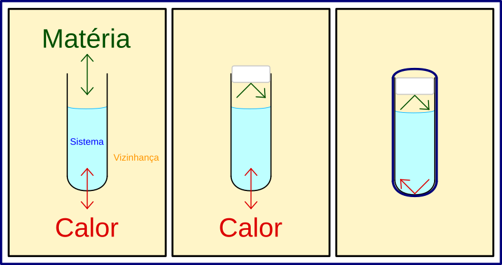
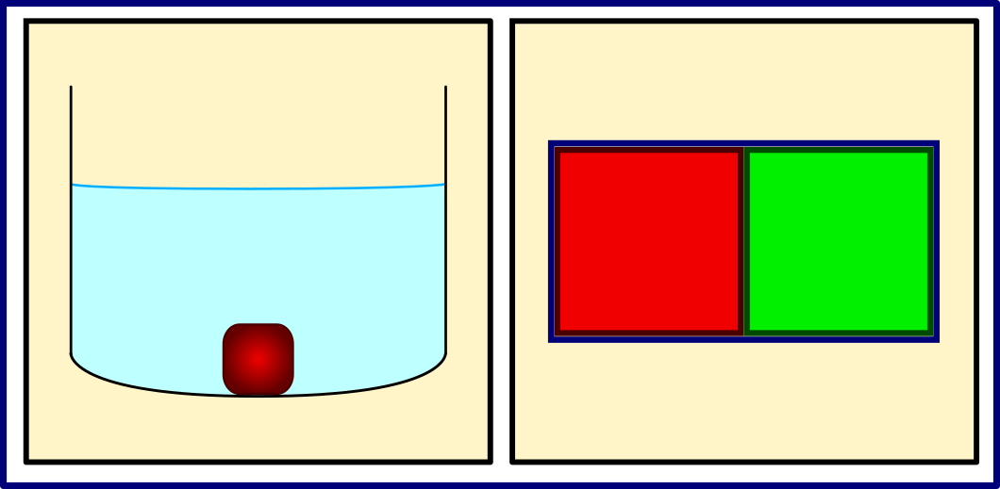

Dentre os diferentes sistemas possíveis, os compostos por <b>gases</b> são os mais simples. Isso decorre do fato das moléculas que compõe os gases estarem, geralmente, muito distantes umas das outras. Essa grande distância faz com que a energia de interação intermolecular seja relativamente pequena e com que o volume ocupado pelas moléculas seja desprezível perto do volume total do sistema, o que torna tais sistemas mais simples de serem estudados e descritos do que sistemas condensados – aqueles formados por líquidos e sólidos. Assim, gases são os primeiros sistemas que estudamos em Termodinâmica.

Contudo, mesmo gases reais ainda possuem propriedades que podem ser difíceis de serem descritas ou utilizadas em modelos teóricos. Quando a densidade de partículas é grande, não podemos desprezar nem as interações intermoleculares e nem o volume ocupado pelas moléculas. Então, antes de estudarmos sistemas mais complexos, iniciaremos pelo modelo mais simples e famoso para gases: os <b>gases ideais</b> (GIs). GIs são gases formados por moléculas puntiformes (i.e., que não ocupam volume no espaço) e não-interagentes (i.e., que não possuem energia de interação intermolecular). Tais gases, quando confinados, podem apenas colidir elasticamente com as paredes dos recipientes que os contém. E apesar de nenhum gás ser realmente ideal, gases reais podem se <b>comportar idealmente</b>, dependendo das condições. Para podermos discutir adequadamente quais são essas condições, precisamos definir quais variáveis macroscópicas podem ser utilizadas para descrever o estado de um gás, e precisamos definir, também, qual a relação matemática entre tais variáveis.

Gases podem ter o seu estado caracterizado por propriedades macroscópicas como pressão (<i>p</i>), volume (<i>V</i>), temperatura (<i>T</i>) e número de mols (<i>n</i>). Assim, se uma mesma quantidade de um mesmo gás for submetida à mesma pressão e estiver em uma mesma temperatura em dois lugares distintos no mundo, então podemos dizer que ambos se encontram no mesmo estado. Isso significa que toda e qualquer propriedade que seja medida em ambas amostras terá o mesmo valor médio. Também significa que, caso um terceiro sistema seja preparado com os mesmos valores de número de mols, pressão e temperatura, então ele também estará no mesmo estado que os outros. Para além disso, todos os três sistemas possuirão o mesmo volume. Assim, podemos concluir que o volume depende exclusivamente da pressão, número de mols e temperatura. Na verdade, essas quatro grandezas estão relacionadas entre si através de uma equação. Equações que relacionam variáveis que definem o estado de um sistema são conhecidas como <b>equações de estado</b> (e.d.e.).

A equação de estado de um gás ideal, uma das equações mais conhecidas na físico-química, foi obtida a partir da combinação de observações experimentais de Boyle (relação p e V), Charles (relação V e T), Gay-Lussac (relação p e T) e de Avogadro (relação n e V). É possível obter essa equação a partir do <b>teorema do virial</b>. Para isso, tratamos as moléculas do gás como moléculas sem estrutura interna e, se assumirmos que todas as forças de interação entre as partículas são dadas por interações por pares, podemos escrever, para um sistema formado por <i>N</i> partículas, a equação:

  

    $${\vec F}_i = {\vec F}_i^p + {\vec F}_i^{pot} \\
    \color{blue}{\boldsymbol{\overline{\sum_i^N {\vec F}_i \cdot {\vec r}_i} = \overline{\sum_i^N {\vec F}_i^p \cdot {\vec r}_i} + \overline{\sum_i^N {\vec F}_i^{pot} \cdot {\vec r}_i}}}$$
  

  

    E2.1
  

sendo \\({\vec F}_i\\) o vetor resultante da força exercida na i-ésima partícula,  é o vetor posição da partícula i,  é o vetor força que a parede exerce na partícula i durante uma colisão com a parede, e  é o vetor força exercida na partícula i pela interação com as outras partículas do sistema. Para um gás ideal, o termo  é zero.

{: .mx-auto.d-block :}

<b>Figura 1.</b> Três tipos de sistemas termodinâmicos. Esquerda) Sistema aberto, matéria pode ser inserida/removida do sistema e processos de calor podem ocorrer; Meio) Sistema fechado, pode haver processos de calor, mas matéria não pode ser inserida/removida do sistema; Direita) Sistema isolado por meio de uma barreira adiabática, matéria não pode ser inserida/removida e não é possível haver processos de calor.

Para além do fluxo de energia entre vizinhança e sistema, por vezes será útil separar o sistema em partes menores, que chamamos de <b>subsistemas</b>. A separação entre os subsistemas pode ser física ou imaginária, também, e o conjunto de todos os subsistemas formam o próprio sistema.

{: .mx-auto.d-block :}

<b>Figura 2.</b> Dois tipos de sistemas: Esquerda) Sistema composto por água e bloco de metal aquecido, bifásico; Direita) Dois subsistemas inicialmente em estados distintos, separados por paredes diatérmicas, mas isolados do resto do universo.

A entrada e saída de energia de um sistema ocorrem através de <b>processos</b> (calor e trabalho, como veremos). Esses processos, no geral, fazem com que as propriedades dos sistemas variem. Então, é fundamental que consigamos definir como um determinado sistema se encontra entes e depois de um processo. Para isso, utilizamos o conceito de <b>estado termodinâmico</b> de um sistema. Definimos por estado termodinâmico o conjunto de variáveis macroscópicos suficientes para caracterizar um sistema. Por exemplo, para um gás ideal, o conjunto das variáveis pressão (<i>p</i>), volume (<i>V</i>) e temperatura (<i>T</i>) pode ser utilizado para caracterizar o estado do sistema. Assim, se dois cientistas em lugares diferentes no mundo trabalhem com o mesmo gás ideal, nas mesmas condições de pressão, volume e temperatura, eles terão um sistema no mesmo estado termodinâmico. O conjunto de todas as variáveis macroscópicas necessárias para definir o estado do sistema é conhecido por <b>conjunto completo</b>.

Com as definições acima, podemos começar a discutir propriedades de sistemas químicos.

